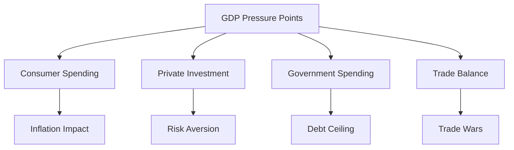

# Trading Through the Storm: Market Analysis & My Edge

While I'm deep in my CS journey, I'm also actively trading to fund this transition. Today, I want to share some thoughts on the current market landscape and how I'm positioning myself.

## The Big Picture: Economic Headwinds

Howard Marks just dropped a fascinating [memo on bubble watch](https://www.oaktreecapital.com/insights/memo/on-bubble-watch), and it got me thinking about the broader economic picture. His key observation resonates deeply:

> "For me, a bubble or crash is more a state of mind than a quantitative calculation... a bubble not only reflects a rapid rise in stock prices, but it is a temporary mania characterized by highly irrational exuberance."

Let's break down what we're seeing:

### GDP Components Under Pressure

The classic GDP equation (Y = C + I + G + X - M) is showing stress across all components:

1. **Consumer Spending (C)**: Getting hammered by inflation
2. **Private Investment (I)**: Significantly reduced
3. **Government Spending (G)**: Austerity measures with debt ceiling
4. **Trade Balance (X-M)**: Facing headwinds from tariffs and reshoring

<h3>GDP Pressure Points</h3>

## Market Wizards' Warning Signs

Several market veterans are raising red flags, and their insights are worth noting:

<h3>Howard Marks on Current Valuations</h3>

"Higher starting valuations consistently lead to lower returns... Today's p/e ratio is clearly well into the top decile of observations... when people bought the S&P at p/e ratios in line with today's multiple of 22, they always earned ten-year returns between plus 2% and minus 2%."

Key metrics from his analysis:
- Magnificent Seven at 32-33% of S&P 500
- U.S. stocks at 70% of MSCI World Index
- Forward P/E ratios suggesting minimal returns

  
Mark Minervini's Technical Analysis

  
🚨 Distribution Phase Signals

<blockquote class="twitter-quote">
"Market breadth deteriorating significantly. Multiple distribution days showing institutional selling. Risk levels elevated." - @markminervini
</blockquote>

  
Geiger Capital's Macro View

  
⚠️ Systemic Risk Warning

## The Dollar Devaluation Thesis

Here's where it gets interesting. The setup looks increasingly like we're heading toward:

1. A bear market phase
2. Followed by significant dollar devaluation to address debt
3. Creating a massive opportunity in hard assets

As Howard Marks notes:
> "It shouldn't come as a surprise that the return on an investment is significantly a function of the price paid for it. For that reason, investors clearly shouldn't be indifferent to today's market valuation."

### My Positioning Strategy

I'm maintaining my edge through:

1. **Systematic Trading**:
   - Using my [Dots Trading System](/Blog/2025/03/03/my-first-post.html) for signal detection
   - Keeping emotions in check with automated execution

2. **Asset Allocation**:
   - Building positions in hard assets
   - Maintaining high cash levels for opportunities
   - Using [Sentinelle](/Blog/2025/03/03/my-first-post.html) for risk management

Key Risk: As Marks warns, "the multiple correction is compressed into a year or two, implying a big decline in stock prices such as we saw in 1973-74 and 2000-02."

## Why This Matters for My CS Journey

This market environment is exactly why I'm:

1. Building robust trading systems
2. Learning CS fundamentals deeply
3. Focusing on AI/ML for better market analysis

The goal isn't just to trade better—it's to build systems that can adapt to changing market conditions while I focus on my CS studies.

## Looking Ahead

The next 6-12 months could be pivotal. While I'm grinding LeetCode and studying SICP, I'm keeping a close eye on:

<h3>Key Indicators</h3>
- Dollar strength indicators
- Hard asset valuations
- Technical market structure
- Systematic risk signals

## My Edge in This Market

1. **Technology**: Building better tools than I've ever had
2. **Systematic Approach**: Removing emotion from execution
3. **Dual Focus**: Using CS skills to enhance trading, using trading to fund CS studies

Remember what Howard Marks emphasizes: Markets don't care about our opinions. They care about supply and demand, flows, and positioning. Stay systematic, stay humble.

---

<strong>Disclaimer:</strong> This post reflects my personal views and analysis. Always do your own research and never trade based solely on someone else's opinion. Market analysis is provided for educational purposes only.

_Follow my journey:_
- [Trading Systems Progress](/Blog/2025/03/03/my-first-post.html)
- [CS Learning Path](/Blog/2025/03/03/my-second-post.html)
- [Weekly Updates](/Blog/2025/03/10/my-third-post.html) 